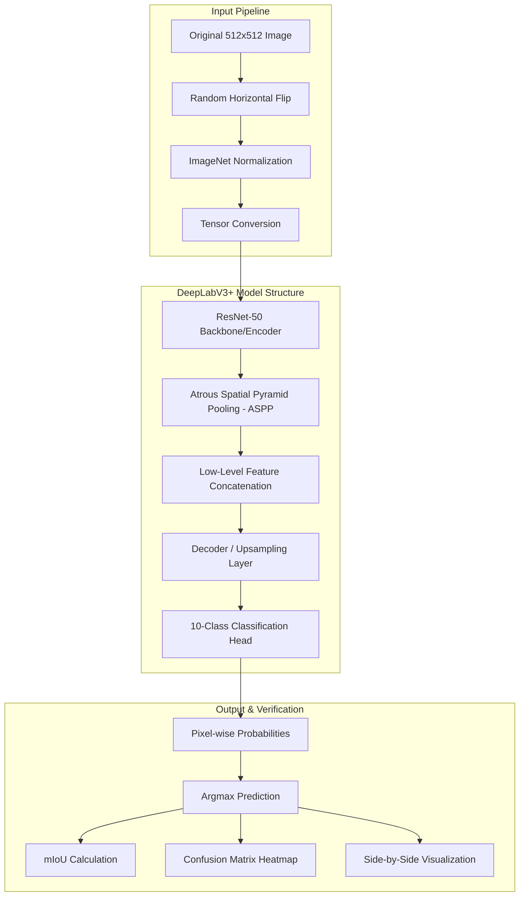

# Offroad Image Segmentation: System Architecture

This document describes the high-level architecture of the **Offroad Autonomous Navigation** model. You can use the descriptions below as prompts for Gemini to generate high-fidelity diagrams or UI mockups.

## 1. High-Level Flow Diagram (Mermaid)

## 2. Textual Description for Gemini Image Generation

**Prompt Copy-Paste:**
> "Generate a professional, high-fidelity technical architecture diagram for a Deep Learning Computer Vision project. The diagram should show three main stages: 
> 
> 1. **Data Ingestion**: Show icons for offroad terrain images being flipped and normalized.
> 2. **Core AI Engine (DeepLabV3+)**: Use a sleek, multi-layered block representing a ResNet-50 backbone connecting to an ASPP (Atrous Spatial Pyramid Pooling) module. Show data flowing through 'Encoder' and 'Decoder' blocks.
> 3. **Output & Diagnostics**: Show a segmented image output (colorful mask over a road) alongside a 10x10 heat map representing a confusion matrix.
> 
> Use a modern, dark-mode aesthetic with vibrant blue, green, and orange gradients to distinguish between the processing layers."

## 3. Component Details
- **Backbone**: `ResNet-50` (Feature extraction using residual blocks).
- **ASPP Module**: Captures multi-scale context by using atrous convolution with different rates.
- **Data Augmentation**: `RandomHorizontalFlip` (Drives generalization for offroad paths).
- **Optimization**: `Adam` optimizer with `ReduceLROnPlateau` scheduler and `AMP` for fast GPU memory management.
